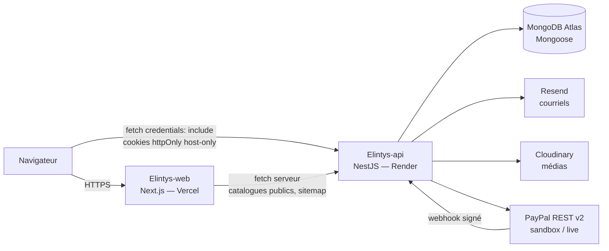

# Architecture actuelle (AS-IS)

> Ce document décrit **uniquement ce qui tourne réellement** dans le code et
> l'hébergement au 2026-09-26. L'architecture cible (PostgreSQL, Workspaces,
> Redis…) est décrite séparément dans
> [`architecture-target.md`](./architecture-target.md) et **n'est pas
> implémentée**. En cas de contradiction avec un document plus ancien
> (Railway, Stripe comme fournisseur principal, Node 20, PostgreSQL…), ce
> document fait foi.

## Vue d'ensemble

Le frontend appelle **directement** l'API : il n'y a ni BFF ni proxy Next.js.
L'API est l'unique frontière de confiance (session, autorisation, règles
métier).

## Dépôts

| Dépôt | Rôle | Branche de production | Intégration |
| --- | --- | --- | --- |
| `NoeKen/Elintys-api` | API NestJS | `master` | `dev` |
| `NoeKen/Elintys-web` | Application web Next.js | `main` | `dev` |
| `NoeKen/Elintys-LP` | Page d'accueil marketing (hors périmètre) | — | — |

Une branche de promotion `uat` existe dans l'API et le web (voir
[`../operations/deployment.md`](../operations/deployment.md)).

## API — `Elintys-api`

| Élément | Réalité dans le code |
| --- | --- |
| Runtime | Node.js `22.x` (`package.json#engines`, `.nvmrc` = `22`) |
| Framework | NestJS 11 (`@nestjs/*` ^11), TypeScript strict |
| Préfixe | `/api/v1` (`app.setGlobalPrefix` dans `src/main.ts`) |
| Base de données | MongoDB via Mongoose 8 (`MongooseModule.forRootAsync`) |
| Validation | `ValidationPipe` global (`whitelist`, `forbidNonWhitelisted`, `transform`) |
| Validation d'environnement | `src/config/env.validation.ts` — fail-fast au démarrage selon `ELINTYS_ENV` |
| Planification | `@nestjs/schedule` dans le processus API (`events/event-lifecycle.scheduler.ts`, chaque minute) + intervalle `media/media-cleanup.service.ts` ; l'expiration des commandes est un endpoint (`POST /ticket-orders-maintenance/expire`) |
| Rate limiting | `@nestjs/throttler`, stockage **en mémoire** du processus (pas de Redis) |
| Documentation | Swagger `/api/docs` hors production, ou si `ENABLE_SWAGGER=true` |
| Santé | `GET /api/v1/health` → `{ status: 'ok', service: 'elintys-api', environment }` |

Modules chargés par `src/app.module.ts` : `auth`, `events`,
`event-registration`, `tickets` (dont `orders`), `payments`, `guests`,
`invitations`, `vendors`, `venues` (+ `venue-managers`), `reviews`,
`favorites`, `discovery`, `notifications`, `waitlist`, `media`, `emails`,
`health`, `ai`.

### Authentification et session

- JWT HS256 signés avec `JWT_SECRET` (access, 15 min par défaut) et
  `JWT_REFRESH_SECRET` (refresh, 7 j par défaut).
- Transport : cookies `access_token` et `refresh_token`, `HttpOnly`,
  `SameSite=Lax`, `Path=/`, `Secure` dès que `NODE_ENV=production` ou
  `ELINTYS_ENV` ∈ {uat, prod}. **Aucun attribut `Domain`** : cookies
  host-only (`COOKIE_DOMAIN` défini ⇒ refus de démarrage,
  `src/config/cookie-domain.ts`).
- `JwtStrategy` accepte le cookie `access_token` puis, à défaut, l'en-tête
  `Authorization: Bearer`. Le web n'utilise que les cookies
  (`credentials: "include"`).
- Guards globaux (`src/main.ts`) : `JwtAuthGuard` (routes publiques via
  `@Public()`), `RolesGuard`, plus `ElintysThrottlerGuard` (`APP_GUARD`).
- `JwtAuthGuard` applique aussi la règle « courriel non vérifié = lecture
  seule » (`EmailVerifiedGuard`), voir
  [`../security/email-verification.md`](../security/email-verification.md).
- CORS : origines exactes `FRONTEND_URL` + `CORS_ORIGINS` ; un middleware
  refuse en 403 les écritures navigateur dont l'`Origin` n'est pas autorisée
  (voir [`../auth-cookies-and-observability.md`](../auth-cookies-and-observability.md)).

> Conséquence de `SameSite=Lax` + host-only : le frontend et l'API doivent
> être sur le **même site** (même domaine enregistrable, ex.
> `app.elintys.com` ↔ `api.elintys.com`) pour que le navigateur envoie les
> cookies sur les appels `fetch`. Un frontend `*.elintys.com` qui appelle une
> API `*.onrender.com` est « cross-site » : voir la section *Anomalies
> connues* de [`../operations/environments.md`](../operations/environments.md).

### Courriels — Resend

- SDK `resend`, clé `RESEND_API_KEY`, expéditeur `EMAIL_FROM`
  (défaut code : `Elintys <no-reply@elintys.com>`).
- Domaine `elintys.com` vérifié dans Resend.
- `EMAIL_DELIVERY_ENABLED=false` coupe l'envoi réel (utilisé en CI/E2E).
  Absent ⇒ envoi actif.

### Médias — Cloudinary

- Mêmes identifiants pour tous les environnements
  (`CLOUDINARY_CLOUD_NAME`, `CLOUDINARY_API_KEY`, `CLOUDINARY_API_SECRET`).
- Isolation par dossier racine `Elintys/<dossier>` : `CLOUDINARY_FOLDER` s'il
  est défini, sinon dérivé de `ELINTYS_ENV` (`local` → `dev`)
  (`src/modules/media/media-environment.ts`). Voir aussi
  [`../media-storage.md`](../media-storage.md).

### Paiements

- **PayPal** (Orders v2) est le fournisseur visé
  (`src/modules/payments/providers/paypal/`, webhook
  `POST /api/v1/payments/paypal/webhook`). Environnement choisi par
  `PAYPAL_ENV` (`sandbox` | `live`), indépendant de `NODE_ENV`
  (`src/config/paypal-environment.ts`).
- **Stripe : code historique toujours présent** (`stripe-payment.provider.ts`,
  `payments.controller.ts` : `POST /payments/checkout`, `POST /payments/webhook`,
  `POST /payments/refund/:purchaseId`, dépendance `stripe`). Il n'est pas
  retiré.
- Sélection serveur (`payment-provider.registry.ts`) :
  1. `PAID_CHECKOUT_ENABLED=true` **et** `PAYPAL_PROVIDER_ENABLED=true` → PayPal ;
  2. `PAID_CHECKOUT_ENABLED=true` seul → **Stripe** ;
  3. fournisseur de test autorisé (`TEST_PAYMENT_PROVIDER_ENABLED=true`,
     uniquement `local`/`ci`/`dev` et `NODE_ENV≠production`) → test ;
  4. sinon → 503 `PAID_CHECKOUT_NOT_READY`.

  ⚠ Ouvrir `PAID_CHECKOUT_ENABLED` sans `PAYPAL_PROVIDER_ENABLED` bascule sur
  Stripe : toujours activer les deux ensemble.
- Détails : [`paid-ticketing.md`](./paid-ticketing.md),
  [`../runbooks/paypal-payments.md`](../runbooks/paypal-payments.md).

### IA

Module `ai` présent (SDK Anthropic via `ANTHROPIC_API_KEY`), fonctionnalités
de Phase 2 ; aucune variable IA n'est exigée par la validation d'environnement.

## Web — `Elintys-web`

| Élément | Réalité dans le code |
| --- | --- |
| Framework | Next.js `16.3.x` App Router, React 19 (`package.json`) |
| Style | Tailwind CSS v4 (tokens dans `src/app/globals.css`) |
| Données | TanStack Query v5, client fetch central `src/shared/lib/api.ts` |
| Formulaires | react-hook-form + Zod 4 |
| Session | aucune lecture de cookie côté Next : garde de navigation cliente qui restaure la session via `GET /auth/me` |
| Environnement | `NEXT_PUBLIC_ELINTYS_ENV` (`src/shared/config/environment.ts`) : badge UAT, `noindex` dev/uat, Analytics prod uniquement |
| Tests | Vitest + Testing Library, Playwright (smoke / functional / visual) |

Détails : `Elintys-web/docs/deployment-environments.md`, `Elintys-web/TESTING.md`.

## Hébergement

| Composant | Fournisseur | Détail |
| --- | --- | --- |
| API dev | Render `elintys-api-dev` | branche `dev`, région ohio, plan free, `render.yaml` |
| API uat | Render `elintys-api-uat` | branche `uat`, région ohio, plan free, `render.yaml` (créé le 2026-09-26) |
| API prod | Render `Elintys-api` | branche `master`, région oregon, plan free, **géré manuellement** (hors `render.yaml`) |
| Web | Vercel, projet `elintys-web` | `main` → Production, `dev`/`uat` → déploiements de branche |
| Landing | Vercel, projet `elintys-lp` | hors périmètre |
| Base | MongoDB Atlas | cluster hébergeant `elintys-dev` ; `elintys-uat` à créer ; nom de la base prod à confirmer |
| DNS | Hostinger (`elintys.com`) | voir [`../operations/environments.md`](../operations/environments.md) |

Il n'y a **pas** de Railway, de PostgreSQL, de Redis, de file de messages ni
de worker séparé dans l'architecture actuelle.

## Environnements

Cinq valeurs de `ELINTYS_ENV` : `local`, `ci`, `dev`, `uat`, `prod`
(`src/config/elintys-environment.ts`). `NODE_ENV=production` est utilisé par
dev, uat **et** prod : il ne suffit jamais à savoir où l'on est. Matrice
complète : [`../operations/environments.md`](../operations/environments.md).
