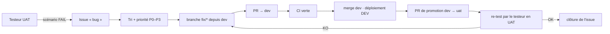

# Flux de traitement des bugs (recette → production)

## Étapes

1. **Constat** — le testeur exécute un scénario en UAT ; en cas d'échec, il
   ouvre une issue selon [`../uat/README.md`](../uat/README.md#signaler-un-bug).
2. **Tri** — le mainteneur confirme la reproduction, choisit le dépôt
   (`Elintys-web` ou `Elintys-api`), fixe la priorité :

   | Priorité | Critère | Traitement |
   | --- | --- | --- |
   | P0 | sécurité, perte/fuite de données, paiement erroné, recette bloquée | immédiat, bloque toute promotion |
   | P1 | parcours critique cassé sans contournement (inscription, connexion, billet, création d'événement) | avant la prochaine promotion vers la production |
   | P2 | fonctionnalité dégradée avec contournement | planifié ; release possible si accepté explicitement |
   | P3 | cosmétique, texte, confort | backlog |

3. **Correction** — branche `fix/<issue>-<résumé>` créée depuis `dev`, avec
   un test de non-régression qui échoue avant le correctif.
4. **PR vers `dev`** — référence l'issue (`Refs #<n>`), checks requis verts
   ([`ci-cd.md`](./ci-cd.md#checks-requis)).
5. **Promotion** — PR `dev → uat` ; déploiement UAT automatique au merge.
6. **Re-test** — le testeur rejoue le scénario en UAT et commente l'issue.
7. **Clôture** — issue fermée après re-test OK ; sinon retour à l'étape 3.

## Interdits

- Corriger directement sur `uat`, `master` ou `main` (y compris « petit
  correctif urgent ») : tout passe par `dev`.
- Désactiver, ignorer ou supprimer un test pour obtenir une CI verte.
- Joindre des secrets, mots de passe, cookies ou données personnelles réelles
  à une issue ou une PR (dépôts publics).

Un correctif P0 de production suit le même chemin, en accéléré (promotion
dès la CI verte) ; le rollback reste possible pendant ce temps
([`deployment.md`](./deployment.md#rollback)).
