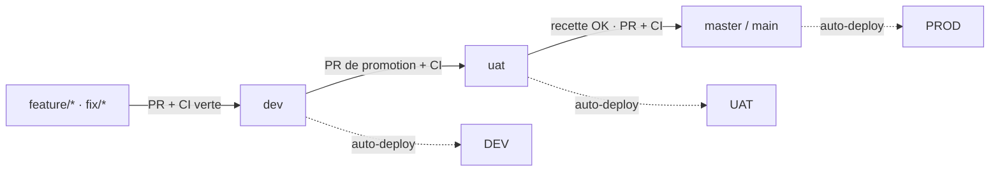

# Déploiement et promotion

S'applique à `Elintys-api` (production = `master`) et `Elintys-web`
(production = `main`). Environnements détaillés :
[`environments.md`](./environments.md). CI : [`ci-cd.md`](./ci-cd.md).

## Flux de branches

1. Toute modification part d'une branche `feature/*` ou `fix/*` créée
   depuis `dev`.
2. PR vers `dev` → checks requis verts → merge → déploiement DEV
   automatique (Render `elintys-api-dev`, Vercel branche `dev`).
3. PR de promotion `dev → uat` (aucun commit direct sur `uat`) → checks verts
   (côté web, `e2e-full` s'exécute sur les PR vers `uat`) → merge →
   déploiement UAT automatique.
4. Recette par les testeurs sur UAT ([`../uat/README.md`](../uat/README.md)).
5. PR `uat → master` (API) / `uat → main` (web) → checks verts → merge →
   production.

Interdits : développer ou corriger directement sur `uat`, `master` ou `main` ;
force-push ; suppression de ces branches (bloqués par la protection de
branche). Un correctif trouvé en recette suit le
[flux de bugs](./bug-workflow.md) et repasse par `dev`.

## Protection des branches (GitHub)

| Dépôt | Branches | Règles |
| --- | --- | --- |
| API | `master`, `dev`, `uat` | PR obligatoire (0 approbation — mainteneur unique), force-push et suppression interdits ; `enforce_admins` sur `master` uniquement |
| Web | `main`, `dev`, `uat` | idem ; `enforce_admins` sur `main` uniquement |

Checks requis : voir [`ci-cd.md`](./ci-cd.md#checks-requis).

Environnements GitHub : `development` (branche `dev`), `uat` (branche `uat`),
`production` (branche `master` pour l'API, `main` pour le web ; relecteur
requis NoeKen). Côté web, `production` a été fusionné (casse ignorée) avec
l'environnement `Production` créé par Vercel.

> Les workflows actuels ne référencent aucun environnement GitHub : le
> relecteur requis de `production` ne bloque donc pas un déploiement Render ou
> Vercel déclenché par Git. La barrière effective avant la production est la
> PR obligatoire sur `master`/`main`.

## Tests en UAT

- Données : `seed:uat` (comptes `@uat.elintys.test`) + comptes créés par les
  testeurs avec leur vraie adresse.
- Paiement : PayPal **sandbox** uniquement ; actuellement fermé
  (`PAID_CHECKOUT_ENABLED=false`, `PAYPAL_PROVIDER_ENABLED=false`) tant que les
  identifiants sandbox ne sont pas copiés dans Render.
- Vérification de déploiement :
  `curl -s https://elintys-api-uat.onrender.com/api/v1/health` doit renvoyer
  `"environment":"uat"`, et le web UAT affiche le badge « UAT ».

### Actions manuelles restantes pour ouvrir l'UAT

1. Atlas : créer `elintys-uat` + utilisateur dédié `readWrite@elintys-uat`.
2. Render `elintys-api-uat` : remplacer les `__SET_ME__` (`MONGODB_URI`,
   `RESEND_API_KEY`), renseigner `EMAIL_FROM`, Cloudinary ; définir le health
   check path `/api/v1/health` dans le dashboard (non réglable par l'outil).
3. Initialiser la base : [`database-migrations.md`](./database-migrations.md#première-initialisation-de-la-base-uat).
4. Vercel `elintys-web` : domaine `uat.elintys.com` sur la branche `uat` et
   variables de branche (`NEXT_PUBLIC_ELINTYS_ENV=uat`, `NEXT_PUBLIC_API_URL`,
   `NEXT_PUBLIC_SITE_URL`, `NEXT_PUBLIC_PAYPAL_ENV=sandbox`,
   `NEXT_PUBLIC_DISABLE_DEVTOOLS=true`).
5. Résoudre l'anomalie cookies cross-site
   ([`environments.md`](./environments.md#anomalies-connues)) — sans quoi la
   connexion ne tiendra pas en UAT.
6. PayPal sandbox (optionnel) : copier `PAYPAL_CLIENT_ID`,
   `PAYPAL_CLIENT_SECRET`, `PAYPAL_WEBHOOK_ID` sandbox, puis passer
   **ensemble** `PAYPAL_PROVIDER_ENABLED=true` et `PAID_CHECKOUT_ENABLED=true`.

## Préalables production

État constaté du service Render `Elintys-api` (prod) : branche `master`
**81 commits derrière `dev`**, build `npm install; npm run build`, start
`npm run start`, aucun health check, plan free, région oregon.

À corriger **avant la prochaine release** :

- [ ] Build : `npm ci --include=dev && npm run build && npm prune --omit=dev`
      (identique à dev/uat ; `npm install` n'est pas reproductible).
- [ ] Start : `npm run start:prod` (même commande `node dist/main` que
      `start`, aligné sur dev/uat).
- [ ] Health check path : `/api/v1/health`.
- [ ] Node 22 (lu depuis `.nvmrc` / `engines`).
- [ ] Variables exigées par `env.validation.ts` avec `ELINTYS_ENV=prod` —
      sans elles **l'API refusera de démarrer** :
  - `NODE_ENV=production`, `ELINTYS_ENV=prod` ;
  - `MONGODB_URI` nommant explicitement la base prod (ni `dev`, `uat`,
    `test`, `local`) — nom à confirmer ;
  - `JWT_SECRET`, `JWT_REFRESH_SECRET` : ≥ 32 caractères, distincts ;
  - `FRONTEND_URL=https://app.elintys.com` (origine nue, sans `/` final) ;
  - `CORS_ORIGINS` : au moins une origine https, sans `*` ;
  - `RESEND_API_KEY` et `EMAIL_FROM` (sauf `EMAIL_DELIVERY_ENABLED=false`) ;
  - `CLOUDINARY_CLOUD_NAME`, `CLOUDINARY_API_KEY`, `CLOUDINARY_API_SECRET`
    (avertissement si absents) ; `CLOUDINARY_FOLDER` absent ou sans
    `dev|uat|test|local|ci` ;
  - si PayPal activé : `PAYPAL_ENV=live` + `PAYPAL_CLIENT_ID`,
    `PAYPAL_CLIENT_SECRET`, `PAYPAL_WEBHOOK_ID` live ;
  - `TEST_PAYMENT_PROVIDER_ENABLED` absent ou `false` ; `COOKIE_DOMAIN` absent.
- [ ] Migrations de la release rejouées d'abord sur UAT, puis en prod selon
      [`database-migrations.md`](./database-migrations.md#restrictions-production).
- [ ] Web Vercel Production : `NEXT_PUBLIC_ELINTYS_ENV=prod`,
      `NEXT_PUBLIC_API_URL=https://api.elintys.com/api/v1`,
      `NEXT_PUBLIC_SITE_URL=https://app.elintys.com`.

## Checklist de release production

1. Recette UAT validée (aucun bug P0/P1 ouvert, P2 acceptés explicitement).
2. `dev`, `uat` et la PR `uat → master/main` : tous les checks requis verts.
3. Backup prod vérifié (`backup:db --environment=prod` avec les
   confirmations production) et restauration déjà répétée sur UAT.
4. Variables Render/Vercel prod vérifiées (liste ci-dessus).
5. Merge API d'abord si le web dépend d'un nouveau contrat API, sinon ordre
   indifférent ; migrations appliquées avant le trafic sur le nouveau code
   lorsqu'elles créent des index uniques.
6. Après déploiement : `GET https://api.elintys.com/api/v1/health` →
   `"environment":"prod"` ; connexion, consultation d'un événement,
   parcours critique de la release.
7. Surveiller les logs Render/Vercel 30 min (`x-request-id` pour corréler).

## Rollback

| Couche | Procédure |
| --- | --- |
| API (Render) | Dashboard du service → *Deploys* → choisir le dernier déploiement sain → *Rollback* / *Redeploy*. Puis revert du commit fautif sur la branche (par PR) pour que le prochain auto-deploy ne réintroduise pas le problème. |
| Web (Vercel) | Projet `elintys-web` → *Deployments* → déploiement sain → *Instant Rollback* (production). Puis revert par PR. |
| Base | Restauration manuelle depuis le backup pré-migration ([`database-migrations.md`](./database-migrations.md#rollback-et-restauration)). Si la migration propose `--rollback` (index seulement), le préférer. |
| Paiements | Couper l'encaissement sans redéployer le code : `PAID_CHECKOUT_ENABLED=false` dans Render (redémarrage du service). |

Un rollback applicatif ne défait pas une migration : vérifier la
compatibilité du code précédent avec le schéma/index en place.
